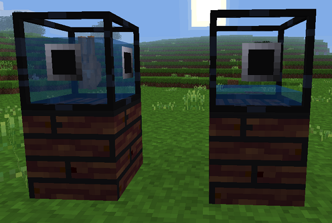

# Futuristic machines for Minetest

This experimental mod adds extra machines for your space and futuristic adventures in Minetest.

Totally done in the spirit of immersion!

It depends on:
- technic, pipeworks
- default, bucket, wool
- mobs (redo) — for the Incubator
- vacuum — for the Oxygenator (soon coming?)

## Incubator

The **incubator** is a MV machine consisting in a tank of nutrient-rich liquid.

On its own, it behaves as an item pedestal (right-click with an item to insert it, punch to release it), accessible only to its owner. You may as well use it as such, as a kind of aquarium for display, if this is your wish.

But when connected to a MV power supply, the machine turns into and incubator and cloning facility for your pets. Place a mob (egg) in it, and it due time you will get its exact clones.

Although the machine is of a very advanced technology, by choice of design:
- It is somewhat energy expensive.
- It is pretty slow.
- It does not have any inventory, but only outputs to tubes.
- It still demands power when containing other non-clonable items.

_A bee in the incubator, and a cloned bee in the ouput tube_

_Crafting recipe_

_Incubators used as mere item holders_

## Hydroponics

Bored using hoes for farming on regular soil? Annoyed to need a flowing water source nearby? Bothered that you might accidently dig too easily your farming soil?

Or simply curious what these fancy pipes (not tubes) may be worth for?

Then it's time to turn to hydroponics, a method of growing plants without soil, by instead using mineral nutrient solutions in a water solvent.

The **hydroponic substrate block** is your new friend. It connects to pipes on all sides, and when water flows in, it becomes an artificial soil for your crops and plants. 

_A small hydroponic system_

_Crafting recipe: a pipe segment, a storage take and some wool and sillicates as substrate_

