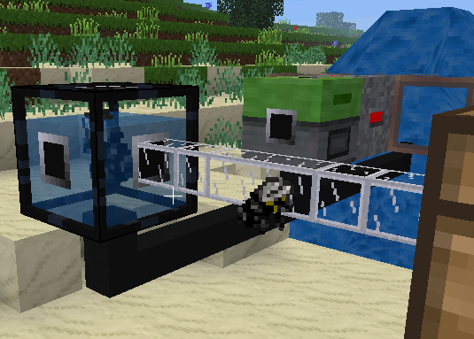
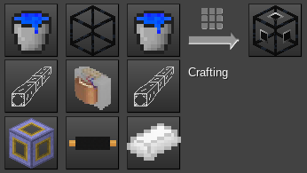

# Futuristic machines for Minetest

This experimental mod adds extra technic machines for your space and futuristic adventures in Minetest.

It depends on:
- technic
- pipeworks
- default, bucket
- mobs (redo)

## Incubator

This MV machine consist in a tank of nutrient-rich liquid.

On its own, it behaves as an item pedestal (right-click with an item to insert it, punch to release it), accessible only to its owner. You may as well use it as such, as a kind of aquarium for display, if this is your wish.

But when connected to a MV power supply, the machine turns into and incubator and cloning facility for your pets. Place a mob (egg) in it, and it due time you will get its exact clones.

Although the machine is of a very advanced technology, by choice of design:
- It is energy expensive
- It is pretty slow
- It does not have any inventory but only outputs to tubes

