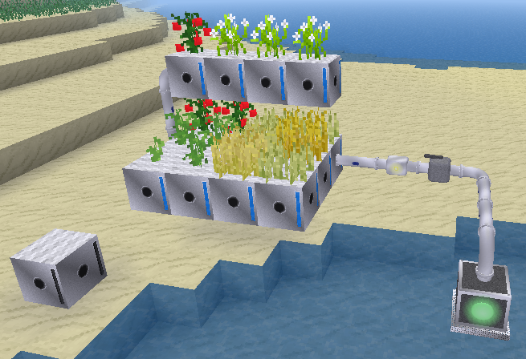
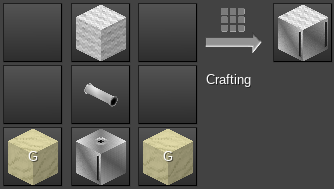

# Futuristic machines for Minetest

This experimental mod adds extra machines for your space and futuristic adventures in Minetest.

Totally done in the spirit of immersion!

It depends on:
- technic, pipeworks
- default, bucket, wool
- mobs (redo), farming (for salt), dye — for the Incubator
- vacuum — for the Oxygenator (soon coming?)

## Items

| Item                        | Image     | Crafting |
| --------------------------- | -------- | ----- |
| "Indistinct nutrients"      |  | Extract from a failed cloning experiment or craft from a bucket of water, salt and dirt | 
| "Failed cloning experiment" |  | Generated upon failure by the Incubator |
| "Soylent crackers"          |  | Craft from "indistinct nutrients" and dye. |

As artificial food, the crackers are not very nutritive, but you may also use them as fuel...

Unprocessed nutrients and cloning experiments should not be eaten...

## Incubator

The **incubator** is a MV machine consisting in a tank of nutrient-rich liquid.

On its own, it behaves as an item pedestal (right-click with an item to insert it, punch to release it), accessible only to its owner (or privileged bypassers). You may as well use it as such, as a kind of aquarium for display, if this is your wish.

When connected to a MV power supply, the machine turns into and incubator and cloning facility for your pets. Place a mob (egg) in it, and it due time you will get its exact clones.

Although the machine is of a very advanced technology, by choice of design:
- It is somewhat energy expensive when operating
- It is pretty slow to clone mobs
- It does not have any inventory, and only outputs to tubes.
- It still demands power when containing other non-clonable items or when depleted.
- The nutrient liquid depletes and has to be refilled (or the incubator replaced)
   - Re-fill with "nutrients" (right-click with a stack of nutrients)
- There are random mischances of failure
   - Normal failure: a "failed cloning experiment" is ejected and operating resumes.
   - Critical failure, the input mob is destroyed (replaced by a "failed cloning experiment")
   - The longer the input item string, the higher the failure ratio. So you may clone your favorite tamed, 
     even rune-protected pet, but expect more failures...

_A bee in the incubator, and a cloned bee in the ouput tube_

_Crafting recipe_

## Hydroponics

Bored using hoes for farming on regular soil? Annoyed to need a flowing water source nearby? Bothered that you might accidently dig too easily your farming soil?

Or simply curious what these fancy pipes (not tubes) may be worth for?

Then it's time to turn to hydroponics, a method of growing plants without soil, by instead using mineral nutrient solutions in a water solvent.

The **hydroponic substrate block** is your new friend. It connects to pipes on all sides, and when water flows in, it becomes an artificial soil for your crops and plants. 

_A small hydroponic system_

_Crafting recipe: a pipe segment, a storage take and some wool and sillicates as substrate_

